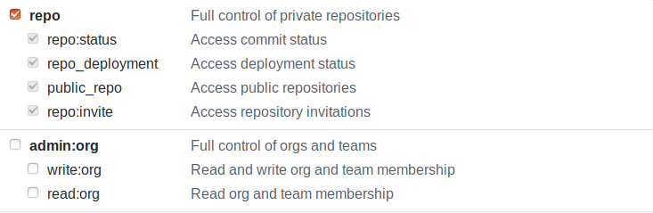
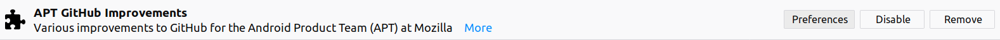
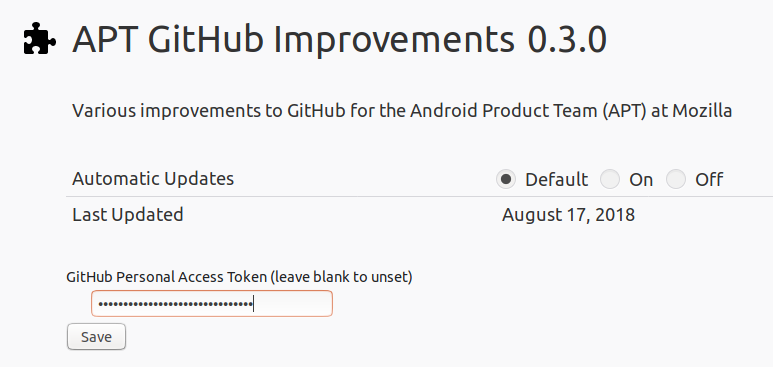

# Adding a GitHub Personal Access Token
[Some features](#list-of-features-using-the-github-api) rely on their ability to request data from the GitHub API. Access to the API can be restricted in two ways:
- The API is rate limited
- The user is on a private repository

Under these conditions, these features may not work well: *adding an access token is highly recommended!*

**Rate limits:** at the time of writing ([official docs][rate]), without authentication, your IP address gets 60 requests per hour. With authentication, your account gets 5000 requests per hour.

## List of features using the GitHub API
- [Link Issues to Pull Requests](features/link_issues_to_prs.md)
- [Indicate PRs that address issues in issues list](features/indicate_prs_to_issues_list.md)

## How to add a token
You'll first have to **create** an access token through the GitHub API: please follow [the official documentation][token]. **Note**: in step 7, you are prompted to select scopes. Select the "repo" box and deselect all other options:

With your access token copied, let's add it to the add-on.

1) Open the Firefox Add-ons preferences by clicking the 3-line menu button in the browser toolbar and selecting "Add-ons".

2) Find APT GitHub Improvements and click "Preferences":

3) Paste your token into the "GitHub Personal Access Token" field and click save:

Congratulations! You're all set up!

[rate]: https://developer.github.com/v3/#rate-limiting
[token]: https://help.github.com/articles/creating-a-personal-access-token-for-the-command-line/
