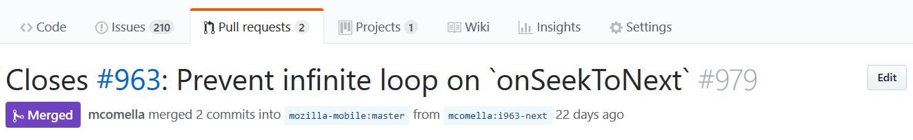

# Feature: Link issues in PR titles
When on a Pull Request page, this feature helps solve the problem navigating to the issues that the PR affects. To do so, it will add links for any issue numbers, e.g. "#963", in the Pull Request title:

In most places, GitHub will automatically create these issue links so this feature makes the experience more consistent.
