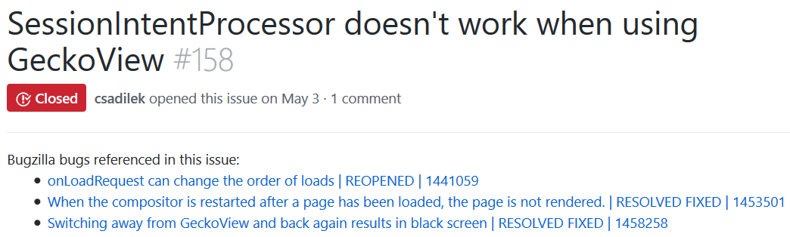

# Feature: Hoist Bugzilla bugs to the top of the issue
Sometimes a GitHub issue will be dependent on the result of a Bugzilla bug. This feature helps solve the problem of knowing about these dependencies by finding all Bugzilla bugs linked in the issue, hoisting them to the top of the issue page, and appending their current status.

