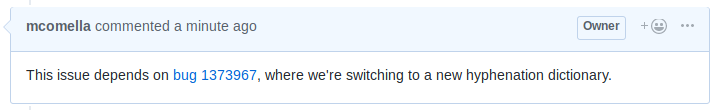

# Feature: Link Bugzilla "Bug 123" in comments
On GitHub, issue links are automatically created: if a user types, "#123", it will link to issue #123. Bugzilla has the same feature: "Bug 123" will link to Bugzilla bug 123.

This feature adds Bugzilla linking support to GitHub: in comments, it links text of the form "Bug 123" to their associated Bugzilla bugs.

This feature works together with the [Hoist Bugzilla Bugs feature](hoist_bugzilla_bugs_to_top_of_issue.md) so that these bugs and their statuses are hoisted to the top of the issue.
