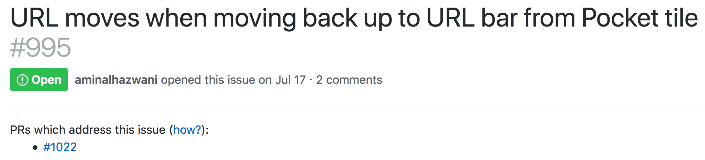
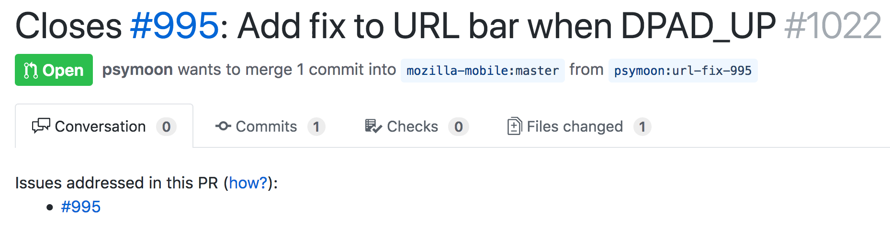

# Feature: Link issues to Pull Requests (and vice versa)
GitHub issues are created to address a product defect and Pull Requests are created to address one or more GitHub issues. This creates a desire for users to navigate from an issue to the Pull Request that addresses it, or vice versa. For example, if you click into an issue from the issues list, you may wonder, "Is there a pull request open for this?" However, by default GitHub [makes getting from issue to PR impractical](#built-in-ways-github-links-issues-to-prs).

To solve this problem, on an issue page, we insert a link for each PR that addresses this issue:

And on a PR page, we insert a link for each issue that the PR addresses:

**It is recommended to add a GitHub access token when using this feature.** Without it, the feature may be rate limited by the GitHub API and will not work as well on private repositories.

### Criteria for PRs that address issues
We consider a PR to address an issue if the issue number appears in:
- The PR's title
- A commit summary (i.e. the first line)

We intentionally omit issues referenced in PR comments to reduce the number of API calls made.

### How we get PR data (and why it's not perfect)
We discover which PRs address which issues a few different ways:
- Scrape a PR page when opened
- Access the GitHub API

The GitHub API is rate limited so we only access it periodically: this can lead to situations where the links we insert aren't up-to-date with the current PR state. Users can work around this by visiting the PR page of each PR they'd like to force to be up-to-date, which we'll scrape without making a GitHub API request.

### Built-in ways GitHub links issues to PRs
By default, GitHub will insert the following Pull Request references on an issues
